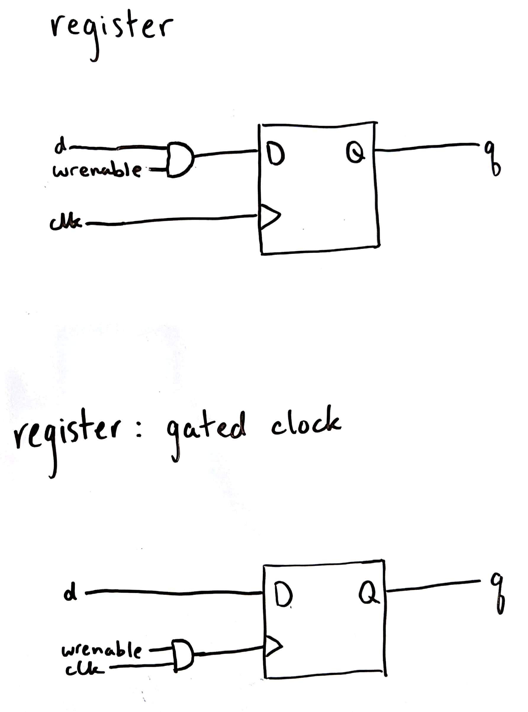

# HW4: conveniently organized deliverables (maybe?)

## Deliverable 1: Register structural diagrams

## Deliverable 2: `register32` module

Available [here](register.v). I tried using a generate block to make a bunch of the `register` module provided, but I couldn't figure out how to make that work with output `q` still being a `reg`. I ended up just copying the code from `register` because, with the magics of behavioral Verilog, it still works (I think). I'll probably ask for help before it's due.

## Deliverable 3: `register32zero` module

Also available [here](register.v). Like for `register32`, I had a hard time making this work with `q` still being a `reg`. I ended up putting it in an `always` block that's always true, which might loop forever. Not sure if it'll work. I'll probably ask for help before it's due.
